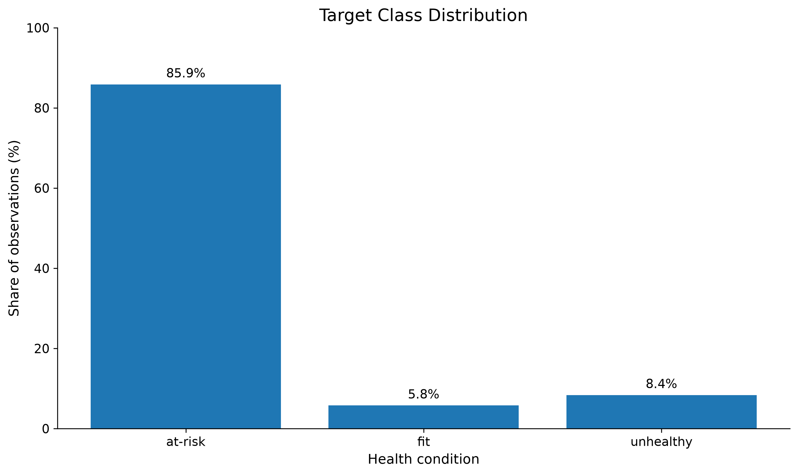
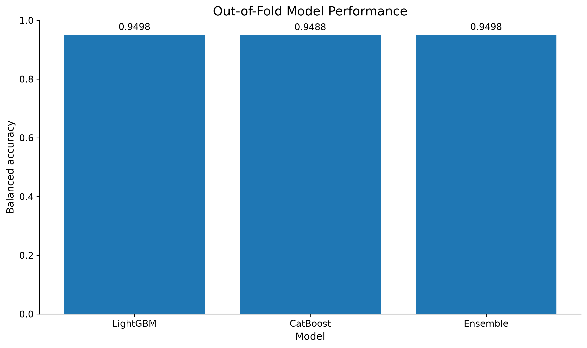
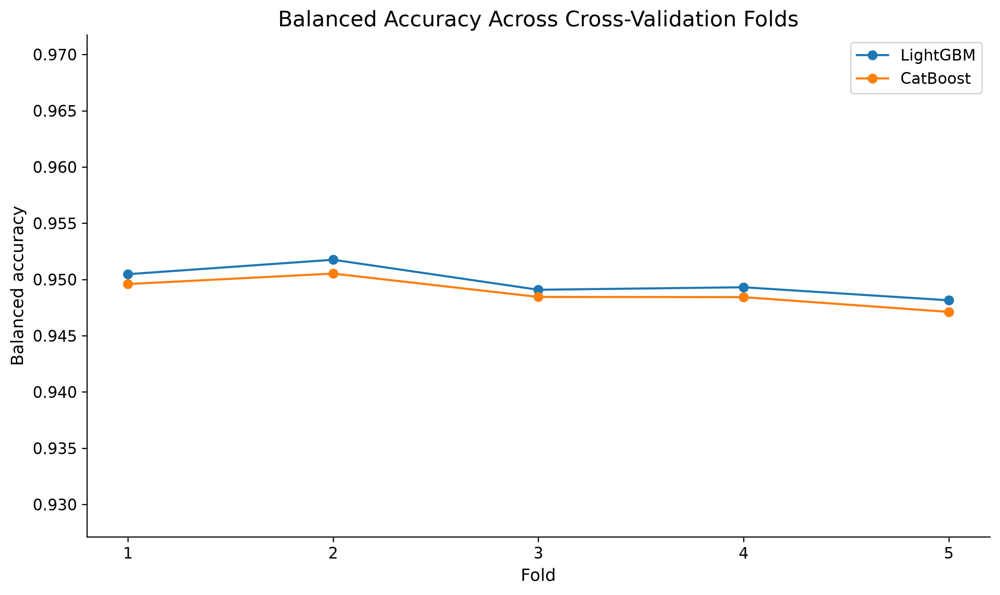
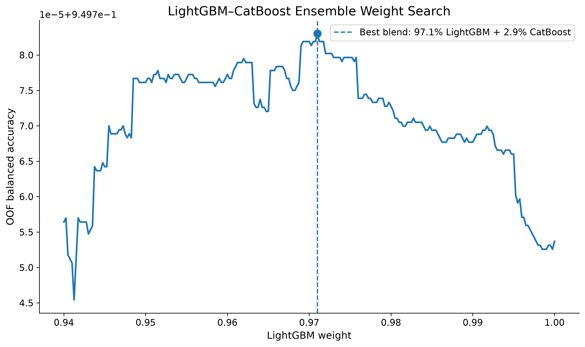
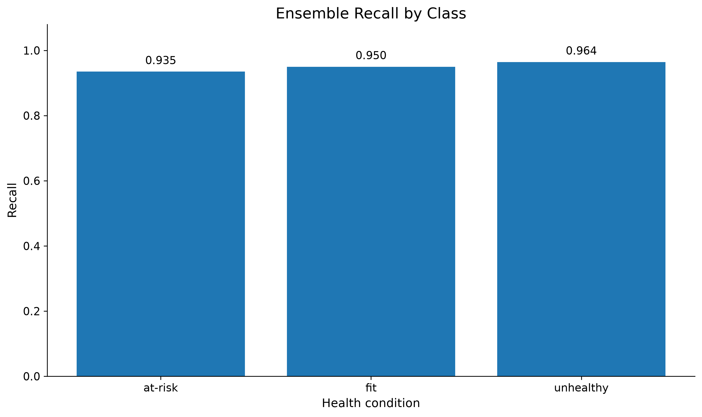
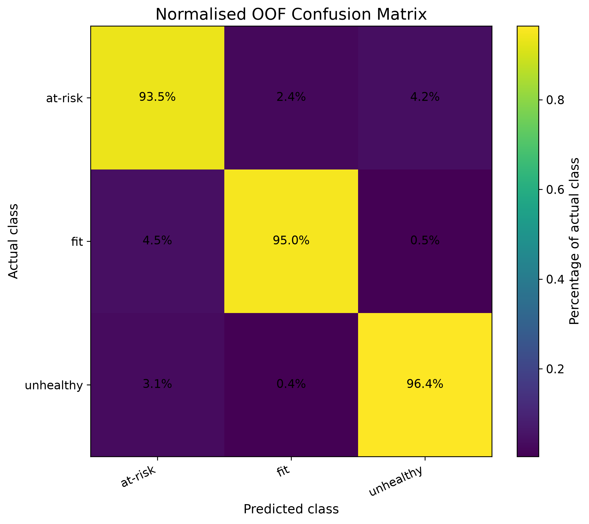

# Student Health Risk Classification

An end-to-end multiclass classification project developed for a Kaggle competition using **LightGBM**, **CatBoost**, **Optuna**, and an out-of-fold probability ensemble.

The project works with **690,088 training observations** and a highly imbalanced target variable. The modelling workflow focuses on reliable class-level performance using **Balanced Accuracy**, stratified cross-validation, recall analysis, and a normalised confusion matrix.

## Project Overview

The objective is to classify students into three health-risk categories:

- `at-risk`
- `fit`
- `unhealthy`

The target distribution is highly imbalanced:

- At-risk: **85.9%**
- Fit: **5.8%**
- Unhealthy: **8.4%**

Because standard accuracy can be misleading in this setting, the primary evaluation metric is **Balanced Accuracy**.

## Modelling Approach

The complete workflow includes:

- Data cleaning and preprocessing
- Numerical and categorical feature handling
- Behavioural and ratio-based feature engineering
- Class-imbalance handling
- LightGBM training with optimised fixed parameters
- CatBoost tuning with Optuna
- Stratified 5-fold cross-validation
- Out-of-fold probability generation
- Probability-level model blending
- Class-level recall and confusion-matrix analysis
- Automated submission and chart generation

## Results

| Model | OOF Balanced Accuracy |
|---|---:|
| LightGBM | 0.9498 |
| CatBoost | 0.9488 |
| Ensemble | 0.9498 |

The out-of-fold blend search selected:

- **97.1% LightGBM**
- **2.9% CatBoost**

The small CatBoost weight showed that additional models should only be included when they provide complementary predictive information. The ensemble ratio was selected through out-of-fold validation rather than manually chosen assumptions.

### Recall by Class

| Class | Recall |
|---|---:|
| At-risk | 93.5% |
| Fit | 95.0% |
| Unhealthy | 96.4% |

## Visualisations

### Target Class Distribution



### Model Performance



### Cross-Validation Stability



### Ensemble Weight Search



### Recall by Class



### Normalised Confusion Matrix



## Financial Relevance

Although the competition dataset is health-related, the modelling challenges and methods are transferable to financial applications such as:

- Credit-risk classification
- Probability-of-default modelling
- Fraud detection
- Anti-money-laundering alert prioritisation
- Financial-distress prediction
- Insurance claims-risk assessment
- Customer and borrower risk segmentation

These applications often involve similar challenges, including class imbalance, mixed data types, nonlinear relationships, missing observations, and unequal costs associated with false positives and false negatives.

## Project Structure

```text
student-health-risk-classification/
├── data/
│   └── README.md
├── models/
│   ├── best_catboost_parameters.json
│   └── ensemble_results.json
├── results/
│   ├── 01_target_class_distribution.png
│   ├── 02_model_performance_comparison.png
│   ├── 03_fold_performance.png
│   ├── 04_ensemble_weight_search.png
│   ├── 05_recall_by_class.png
│   ├── 06_normalised_confusion_matrix.png
│   └── chart_metrics.csv
├── submissions/
│   └── submission_lgb_catboost_ensemble.csv
├── student_health_risk_final_model_and_charts.ipynb
├── requirements.txt
├── .gitignore
└── README.md
```

## Installation

```bash
pip install -r requirements.txt
```

## Running the Project

1. Download the competition data from Kaggle.
2. Place `train.csv` and `test.csv` in the working directory.
3. Open `student_health_risk_final_model_and_charts.ipynb`.
4. Run the notebook cells from top to bottom.
5. The final submission and visualisations will be generated automatically.

## Development Time

The competition lasted 30 days, but I dedicated three active development days to this project due to other professional and academic commitments.

Considering the scale of the dataset and the limited development time, the result represents a strong and encouraging achievement.

## Technologies

- Python
- Pandas
- NumPy
- Scikit-learn
- LightGBM
- CatBoost
- Optuna
- Matplotlib
- Jupyter Notebook

## Author

**Mohammadmahdi Lotfikooshali**

Machine Learning, Quantitative Finance, and Risk Analytics
